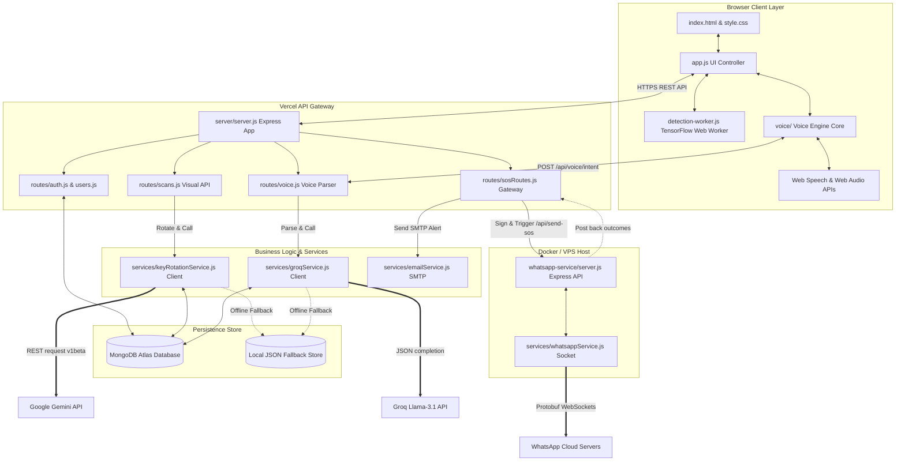
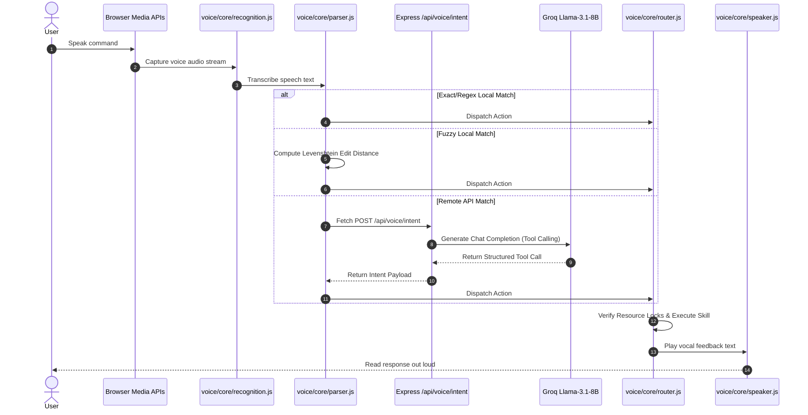
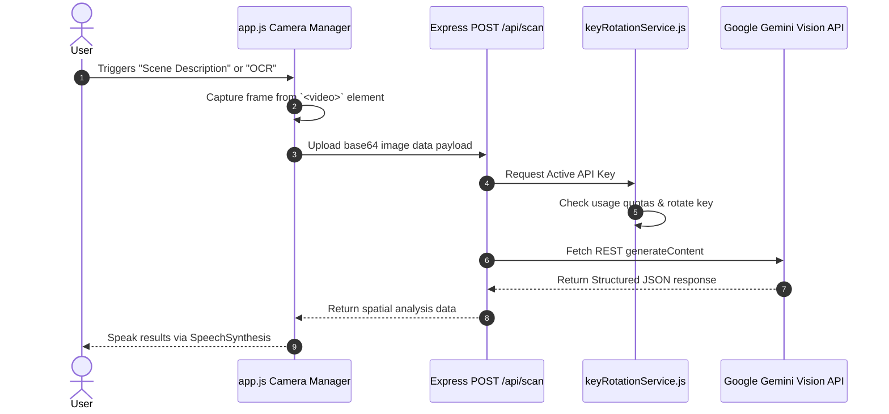
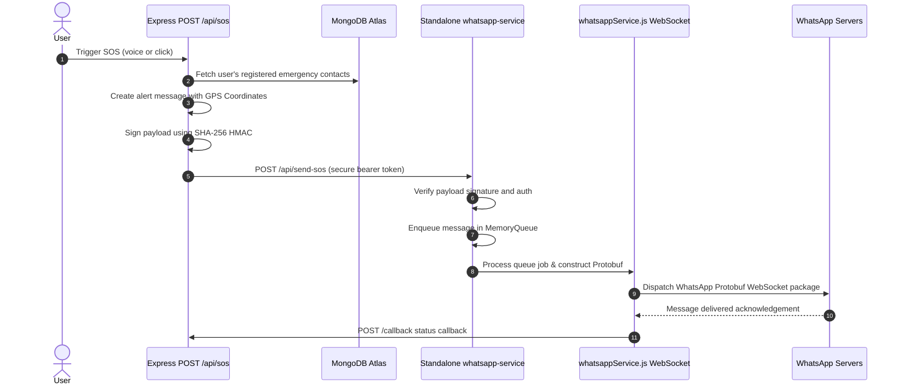

# NAZAR — System Architecture Specification

This document provides a detailed overview of the system architecture, component integrations, database schemas, and data pipelines for NAZAR 2.0.

---

## 1. System Architecture Diagram



---

## 2. Dynamic Pipelines & Request Flows

### Voice Command Pipeline


### Vision Pipeline


### Emergency WhatsApp SOS Flow


---

## 3. Database Schema Models (Mongoose)

### `User` Collection
Stores user authentication details and device identity binds.
```javascript
{
  email: { type: String, unique: true, sparse: true },
  password: { type: String }, // Bcrypt hash
  deviceId: { type: String, unique: true, index: true },
  name: { type: String, default: 'Nazar User' },
  profilePicture: { type: String, default: '' },
  provider: { type: String, default: 'local' },
  createdAt: { type: Date, default: Date.now }
}
```

### `Contact` Collection
Stores helper profiles associated with users.
```javascript
{
  userId: { type: ObjectId, ref: 'User', index: true, required: true },
  name: { type: String, required: true },
  phone: { type: String, required: true }, // Format: E.164 (without prefix if country-formatted)
  relationship: { type: String, required: true },
  createdAt: { type: Date, default: Date.now }
}
```

### `Settings` Collection
Accessibility and visual user preferences.
```javascript
{
  userId: { type: ObjectId, ref: 'User', unique: true, index: true, required: true },
  voiceEnabled: { type: Boolean, default: false },
  speechRate: { type: Number, default: 1.0 },
  speechVolume: { type: Number, default: 1.0 },
  locationSharing: { type: Boolean, default: false },
  darkMode: { type: Boolean, default: false },
  continuousScanning: { type: Boolean, default: false },
  preferredScanMode: { type: String, enum: ['ocr', 'scene'], default: 'scene' },
  updatedAt: { type: Date, default: Date.now }
}
```

### `ApiKeyUsage` Collection
Maintains dynamic metrics tracking for API key rotations.
```javascript
{
  singletonId: { type: String, unique: true, required: true }, // 'default_usage' or 'groq_usage'
  activeKey: { type: Number, default: 1 },
  activeModel: { type: String },
  keyUsage: { type: Map, of: Number }, // Map index to total requests
  totalScans: { type: Number, default: 0 },
  lastResetDate: { type: String }, // YYYY-MM-DD
  lastRotation: { type: Date },
  rotationReason: { type: String },
  history: [
    {
      from: Number,
      to: Number,
      reason: String,
      time: Date
    }
  ]
}
```
