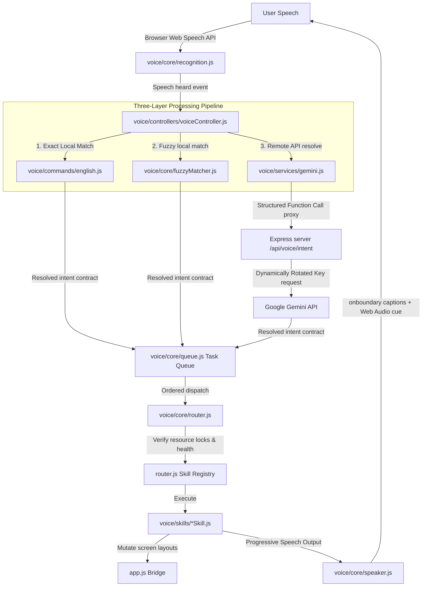

# NAZAR — AI Accessibility & Navigation Companion

<div align="center">
  
  <p><em>Empowering visually impaired users with an intelligent, voice-first accessibility operating layer.</em></p>
</div>

---

[](https://opensource.org/licenses/ISC)
[](https://nodejs.org/)
[](https://www.mongodb.com/)
[](#)

**NAZAR** is a production-grade, open-source AI-powered accessibility companion built specifically to assist visually impaired individuals in navigating their environment. By overlaying a voice-first interface on top of advanced computer vision and text analysis pipelines, NAZAR makes environment description, text reading, object search, and emergency SOS alerts immediate, responsive, and completely hands-free.

---

## 📖 Table of Contents
- [Features](#-features)
- [Tech Stack](#-tech-stack)
- [Architecture](#-architecture)
- [Voice Assistant Lifecycle](#-voice-assistant-lifecycle)
- [Project Structure](#-project-structure)
- [Environment Setup](#-environment-setup)
- [Installation & Running](#-installation--running)
- [Testing](#-testing)
- [Accessibility Design](#-accessibility-design)
- [Security](#-security)
- [Performance Optimization](#-performance-optimization)
- [Roadmap](#-roadmap)
- [Contributing](#-contributing)
- [License](#-license)

---

## ✨ Features

NAZAR delivers a highly responsive accessibility experience through modular skills:

| Category | Feature | Description |
| :--- | :--- | :--- |
| **Visual Core** | **AI Scene Description** | Captures a camera frame on-demand and streams a spatial layout description of surroundings. |
| | **OCR Reading** | Scans, extracts, and speaks text from documents, labels, and screens in real-time. |
| | **On-Demand Object Finder** | Analyzes a single camera capture to locate a target item (e.g., *"Find my keys"*). |
| **Voice Interface** | **Fuzzy Local Matcher** | Resolves near-match voice commands locally using Levenshtein distance $\le 2$ (bypassing AI to reduce latency). |
| | **Gemini Function Calling** | Seamless intent translation using structured Gemini API tools instead of fragile JSON parsing. |
| | **Progressive Spoken Captions** | Displays words synchronously as they are spoken; falls back immediately to complete sentences. |
| | **Reactive Audio Visualizer** | Smoothly displays microphone input using an exponentially smoothed Web Audio Analyser. |
| **Safety & Config** | **Emergency SOS Alerts** | Hands-free verbal triggers that send instant email and GPS sharing alerts to emergency contacts. |
| | **API Key Rotation** | Dynamically rotates through 4 Gemini API keys at 495 requests or 429 errors to guarantee uptime. |
| | **Resource Lock Mutex** | Prevents concurrent device access conflicts (e.g., blocking OCR speech overlap during scene descriptions). |

---

## 🛠️ Tech Stack

| Layer | Technologies |
| :--- | :--- |
| **Frontend** | HTML5, Vanilla CSS3, Vanilla ES6 JavaScript (Module-based structure) |
| **Backend** | Node.js, Express 5.2.1, Helmet (Security Headers), CORS |
| **Database** | MongoDB, Mongoose 9.7.4 (Atomic updates and persistent sessions) |
| **AI Models** | Google Gemini 3.1 Flash Lite (`gemini-3.1-flash-lite`), Gemini Vision API |
| **Voice APIs** | Web Speech API (`SpeechRecognition`, `SpeechSynthesis`), Web Audio API (`AnalyserNode`) |
| **Mail Delivery** | Nodemailer (Secure SMTP transporter) |

---

## 🏗️ Architecture

NAZAR employs a decoupled, event-driven architecture. The user speaks, the transcript is parsed, and actions are scheduled on an asynchronous Task Queue.



---

## 🎙️ Voice Assistant Lifecycle

The assistant transitions through six states via visual cues on the global button, screen overlay, and ARIA live regions:

```
[Idle (Blue mic)]
   │
   ▼  (User Tap / "Hey Nazar" Wake Word) -> plays audioCue.play('listening')
[Listening (Green core, pulsing wave ring)] -> Web Audio visualizer active
   │
   ▼  (Speech detection ends) -> plays audioCue.play('thinking')
[Processing (Progress spinner, rotates)] -> API key evaluation
   │
   ▼  (Intent resolved & executed) -> speaks progressive captions
[Speaking (Purple core, breathing scale)] -> reads output text
   │
   ▼  (Utterance completed / silence timeout)
[Idle (Blue mic)]
```

If an error or network timeout occurs, the button transitions to **Error (Red shake animation)**, plays a low warning chime, and safely returns to **Idle** without trapping the user.

---

## 📁 Project Structure

```text
nazar/
├── server/
│   ├── config.js               # Port, DB, and SMTP configuration
│   ├── db.js                   # Mongoose connection wrapper
│   ├── server.js               # Main Express app bindings and vercel functions
│   ├── middleware/             # Request validation & global error handlers
│   ├── models/                 # Database schemas (Session, Users, Scans)
│   ├── routes/                 # Endpoint routers (Auth, Scans, Emergency)
│   └── services/               # KeyRotationService, EmailService
├── voice/
│   ├── contracts/              # Schema validation schemas
│   ├── core/                   # EventBus, Speech recognition, Speaker pipelines
│   ├── commands/               # Local command word mappings
│   ├── skills/                 # Pluggable modular features (BaseSkill, UISkill, OCRSkill)
│   ├── services/               # API proxies & permission handlers
│   └── utils/                  # Analytics, configurations, test harnesses
├── app.js                      # Core frontend navigation and view logic
├── index.html                  # Accessible layout with Developer HUD
├── style.css                   # Responsive layout stylesheet
└── vercel.json                 # Serverless deployment configuration
```

---

## ⚙️ Environment Setup

Copy `.env.example` to `.env` in the root folder:

```ini
PORT=5000
NODE_ENV=development
MONGODB_URI=mongodb+srv://<db_user>:<db_password>@cluster0.mongodb.net/nazar
GEMINI_API_KEY_1=your_gemini_api_key_1
GEMINI_API_KEY_2=your_gemini_api_key_2
GEMINI_API_KEY_3=your_gemini_api_key_3
GEMINI_API_KEY_4=your_gemini_api_key_4
GEMINI_MODEL=gemini-3.1-flash-lite
GEMINI_TIMEOUT=60000
EMAIL_USER=your_smtp_sender_email@gmail.com
EMAIL_APP_PASSWORD=your_secure_smtp_app_password
```

---

## 🚀 Installation & Running

### 1. Installation
Clone the repository and install Node dependencies:
```bash
git clone https://github.com/kamal1064/nazar2.0.git
cd nazar2.0
npm install
```

### 2. Running Locally
Start the Express server and local client watcher:
```bash
npm run dev
```
The application will boot on `http://localhost:5000`.

---

## 🧪 Testing

### Automated Jest Tests
Run the backend test suite:
```bash
npm test
```
This runs four test categories:
- **Error Handling**: Verifies 400 and 404 responses are clean and sanitized.
- **Post-Refactor**: Validates key rotation sequences and API robustness.
- **Auth System**: Tests secure register, login, and cookies.
- **OAuth Checks**: Tests Google login route wrappers.

### Client-side Replay Tests
To run the local intent matching parser tests directly in the browser:
1. Open the Developer Console (`F12`).
2. Run:
   ```javascript
   window.runVoiceReplayTests();
   ```
3. Look for the `PASSED` logs to confirm that all 24 local commands, fuzzy matches, and regex parsers pass cleanly.

---

## ♿ Accessibility Design

NAZAR is built from the ground up for high compliance under WAI-ARIA standards:
- **Predictable Positioning**: The floating microphone button is locked to the bottom-right corner to preserve visually impaired users' muscle memory. It automatically offsets upward when the camera viewfinder dock opens to prevent overlapping controls.
- **Interactive Focus Binds**: Floating button supports focused keyboard triggers (`Space` or `Enter` to wake or cancel the assistant).
- **Global Keyboard Shortcut**: Press `Ctrl + Shift + V` from any screen to instantly toggle listening.
- **Progressive Captioning Overlay**: Visual captions print synchronously with the SpeechSynthesis utterance (falling back to a full sentence block if character boundary indicators are unavailable).
- **Translucent Backdrop**: Uses `backdrop-filter: blur(16px); background: rgba(15, 23, 42, 0.35);` to ensure low-vision users maintain spatial awareness of their current page.
- **Haptic Vibrations**: Triggers `navigator.vibrate(20)` confirmations on wake detection, button clicks, and command completions.
- **Keyboard Overlay Trap**: Users can immediately press `Escape` or click the backdrop to cancel a listening session.

---

## 🔒 Security

- **API Key Sanitization**: Gemini keys are stored securely on the backend. Client requests proxy through the backend, preventing key exposure.
- **Data Protection**: Authentication routes set encrypted, secure cookies with JWT validation.
- **API Defense**: Integrated `Helmet` (HTTP Headers protection) and custom rate limiting on endpoints:
  - `voiceIntentLimiter`: Restricts AI requests to 30 requests/minute.
  - `authLimiter`: Prevents brute-forcing account endpoints.

---

## 🚀 Performance Optimization

- **Levenshtein Distance Fuzzy Matcher**: Near-matches are resolved locally in under 10ms, eliminating remote API round-trips.
- **Vision Session Caching**: Saves description outputs inside the 10-field conversation memory. If the user asks a follow-up question within 60s, it references `context.lastScene` instead of re-capturing camera frames.
- **Resource Lock Mutex**: Locks microhpne and speech tracks, eliminating collision delays and racing conditions.
- **Atomic Key Updates**: Updates quota states atomically in MongoDB to avoid concurrency bottlenecks during key transitions.

---

## 🗺️ Roadmap

- [x] Global Floating Assistant available on all panels.
- [x] Gemini Function Calling intent resolver integration.
- [x] Web Audio real-time exponentially smoothed visualizer.
- [x] Programmatic double-tone timeout and error chimes.
- [ ] Multilingual speech synthesis support (Hindi, Kannada, and Spanish).
- [ ] Offline local command execution modules using compact local transformers.
- [ ] Integration with hardware smart glasses.

---

## 🤝 Contributing
Contributions are highly welcomed. Please read these basic steps:
1. Fork the project repository.
2. Create your Feature Branch: `git checkout -b feature/AmazingFeature`.
3. Commit your changes: `git commit -m 'feat: add amazing feature'`.
4. Push to the Branch: `git push origin feature/AmazingFeature`.
5. Open a Pull Request.

---

## 📄 License
This project is licensed under the **ISC License** — see the [package.json](package.json) file for details.
