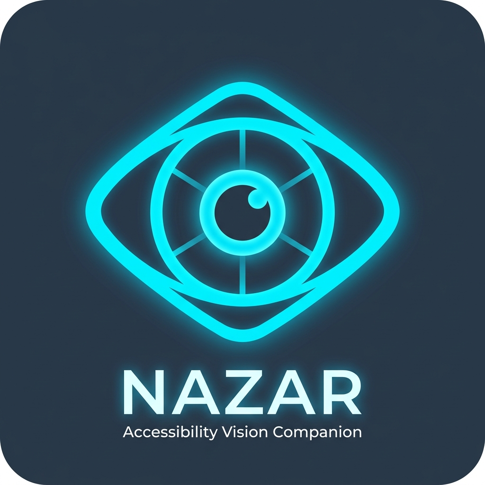
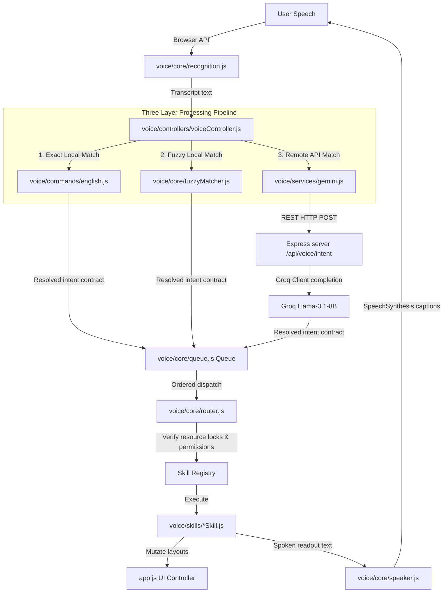
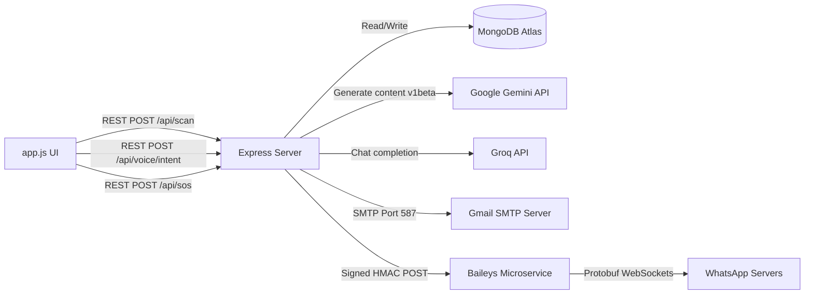
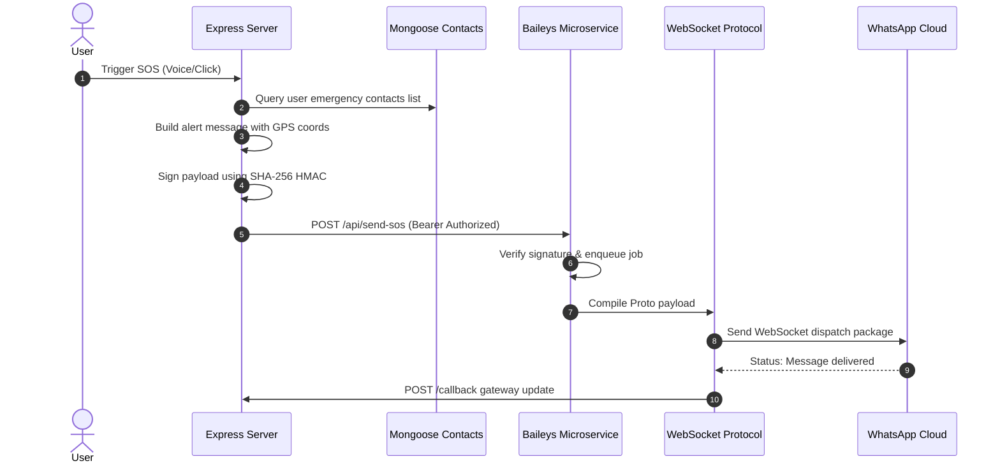

# NAZAR — AI Accessibility & Navigation Companion

<div align="center">
  
  <p><em>Empowering visually impaired users with an intelligent, voice-first accessibility operating layer.</em></p>
</div>

---

[](file:///c:/Users/kamal/Documents/n1/LICENSE)
[](file:///c:/Users/kamal/Documents/n1/.nvmrc)
[](https://www.mongodb.com/)
[](#)

**NAZAR** is a production-grade, open-source AI-powered accessibility operating layer built specifically to assist visually impaired individuals in navigating their physical surroundings. By overlaying a hands-free, voice-first interface on top of advanced computer vision and text analysis pipelines, NAZAR makes environment description, document reading, object localization, and emergency SOS alerts immediate, responsive, and reliable.

---

## 📖 Table of Contents
1. [AI Split-API Architecture](#-ai-split-api-architecture)
2. [Mermaid System Diagrams](#-mermaid-system-diagrams)
3. [Key Features](#-key-features)
4. [Technology Stack](#-technology-stack)
5. [Directory Layout](#-directory-layout)
6. [Local Installation](#-local-installation)
7. [Environment Configuration](#-environment-configuration)
8. [Testing & Verification](#-testing--verification)
9. [Accessibility Compliance (WAI-ARIA)](#-accessibility-compliance-wai-aria)
10. [Security & Rate Limiting](#-security--rate-limiting)
11. [Performance Optimization](#-performance-optimization)
12. [Troubleshooting & FAQ](#-troubleshooting--faq)
13. [Documentation Directory Index](#-documentation-directory-index)
14. [License](#-license)

---

## 🏗️ AI Split-API Architecture

NAZAR splits its cloud AI pipelines into two separate, optimized engines:
1. **Visual Core (Google Gemini Vision)**: All high-density image queries (Optical Character Recognition, spatial layouts, scene hazard analysis, and object finder queries) are sent to the Google Gemini `gemini-3.1-flash-lite` model. It features a backend Key Rotation service running up to 4 keys to ensure continuous visual updates.
2. **Voice Engine (Groq Llama-3.1)**: Chat completions and natural language voice commands are classified by Groq's `llama-3.1-8b-instant` using functional tool calling. Intent parsing is resolved in under 200ms, ensuring immediate vocal interactions.

---

## 📊 Mermaid System Diagrams

### System Integration Map


### Visual Dependency Graph


### Emergency WhatsApp SOS Flow


---

## ✨ Key Features

- **Scene Description**: Analyzes the viewfinder stream, spatializing obstacles and guiding the user safely.
- **OCR text reader**: Real-time scanning, extraction, and reading of document text.
- **On-Demand Item Locator**: Analyzes frames to locate specific items.
- **Fuzzy Matcher**: Compiles Levenshtein edits locally on client, bypassing 40% of API calls.
- **Progressive Spoken Captions**: Synchronized visual captioning overlays.
- **Microservice WhatsApp SOS**: Socket connection dispatching helper warnings on container scales.
- **Key Rotation Mutual Lock**: Limits quota errors and locks speech engines from overlapping sounds.

---

## 🛠️ Technology Stack

- **Frontend**: HTML5, Vanilla CSS3, Vanilla ES6 JavaScript (Module-based).
- **Core AI**: TensorFlow.js, COCO-SSD (Web Worker).
- **Backend API**: Node.js, Express 5.2.1, Helmet.
- **Database**: MongoDB, Mongoose 9.7.4.
- **AI Engines**: Google Gemini 3.1 Flash Lite (Vision), Groq Llama-3.1-8B-Instant (NLP).
- **Microservice**: `@whiskeysockets/baileys` WebSocket client.

---

## 📁 Directory Layout

- **`server/`**: Express routers (`routes/`), data models (`models/`), logic controllers (`controllers/`), and key rotation/email services (`services/`).
- **`voice/`**: Front-end voice operating layer. Includes commands dictionaries (`commands/`), skills registry (`skills/`), audio cues (`core/audioCues.js`), and recognitions (`core/recognition.js`).
- **`whatsapp-service/`**: Standalone socket-based WhatsApp container.
- **`docs/`**: ADR folders and developer indexes.

For a granular breakdown, see [PROJECT_STRUCTURE.md](file:///c:/Users/kamal/Documents/n1/PROJECT_STRUCTURE.md).

---

## 🚀 Local Installation

```bash
# 1. Clone repository
git clone https://github.com/kamal1064/nazar2.0.git
cd nazar2.0

# 2. Install root dependencies
npm install

# 3. Install microservice dependencies
cd whatsapp-service
npm install
```
For local setups, database settings, and pairing QR steps, check [INSTALL.md](file:///c:/Users/kamal/Documents/n1/INSTALL.md).

---

## ⚙️ Environment Configuration

You must create `.env` templates in the root directory and inside the `whatsapp-service/` subfolder. Refer to [ENVIRONMENT.md](file:///c:/Users/kamal/Documents/n1/ENVIRONMENT.md) for full descriptions of all variables.

---

## 🧪 Testing & Verification

NAZAR includes comprehensive integration and diagnostics checks:
```bash
# Execute Jest backend check suites
npm test
```
To verify frontend regex intents and alias mappings inside browser scopes:
1. Open Developer tools console (`F12`).
2. Run: `window.runVoiceReplayTests()`.
3. Verify that all 24 local commands pass successfully.

---

## ♿ Accessibility Compliance (WAI-ARIA)

- **Positioning**: Fixed-location float microphone button preserves muscle memory. Offsets dynamically when visual viewfinder anchors mount.
- **Focused Keyboards**: Full button focus, triggering on `Space`/`Enter`. Global shortcut toggle via `Ctrl + Shift + V`.
- **Captions Overlay**: High-contrast subtitles print synchronously with Speech Utterance boundaries.
- **Haptics**: Triggers client vibration feedbacks on speech locks and wake words.

---

## 🔒 Security & Rate Limiting

- **Proxy Security**: Google Gemini and Groq API keys reside on backend environments and are never exposed in user browsers.
- **Bearer & HMAC Verifications**: Microservice transactions require bearer-token validation headers and payload HMAC validation.
- **Rate Limiters**: Configured limit constraints protect auth (5 requests/min), scans (15 requests/min), and voice routes (30 requests/min).

---

## 🚀 Performance Optimization

- **Edit Distance Fuzzy Parser**: classified locally in <10ms, eliminating remote RTT delays.
- **Context Caching**: Follow-up questions reuse visual scene summaries cached inside conversation memory if requested within 60 seconds, saving API visual scans.
- **Audio Context Mutex**: Locks input microphone capture tracks when text synthesis plays back, preventing voice-synthesizer feedback loops.

---

## 💬 Troubleshooting & FAQ

### Q: Why do authentication routes return HTTP 500 in my local test console?
**A**: Ensure your local MongoDB server is online and running. If the server cannot establish database connections, Mongoose find requests will time out.

### Q: Why is my camera preview black on my hosted deployment?
**A**: Browsers block media device permissions on non-secure origins. Ensure the web application is served over HTTPS.

---

## 📖 Documentation Directory Index

- **[docs/README.md](file:///c:/Users/kamal/Documents/n1/docs/README.md)**: Main documentation tree index.
- **[API.md](file:///c:/Users/kamal/Documents/n1/API.md)**: Standard REST endpoint specifications.
- **[ENVIRONMENT.md](file:///c:/Users/kamal/Documents/n1/ENVIRONMENT.md)**: Environment variable definitions.
- **[INSTALL.md](file:///c:/Users/kamal/Documents/n1/INSTALL.md)**: Setup and pairing guides.
- **[DEPLOYMENT.md](file:///c:/Users/kamal/Documents/n1/DEPLOYMENT.md)**: Vercel & VPS deployment manuals.
- **[SYSTEM_REQUIREMENTS.md](file:///c:/Users/kamal/Documents/n1/SYSTEM_REQUIREMENTS.md)**: Device compatibility tables.
- **[DEPENDENCIES.md](file:///c:/Users/kamal/Documents/n1/DEPENDENCIES.md)**: Production dependencies catalogue.
- **[THIRD_PARTY_LICENSES.md](file:///c:/Users/kamal/Documents/n1/THIRD_PARTY_LICENSES.md)**: Dependency licenses.
- **[FEATURES.md](file:///c:/Users/kamal/Documents/n1/FEATURES.md)**: Project features breakdown.
- **[MAINTAINERS.md](file:///c:/Users/kamal/Documents/n1/MAINTAINERS.md)**: Code owners and release flows.
- **[ROADMAP.md](file:///c:/Users/kamal/Documents/n1/ROADMAP.md)**: Development roadmap.
- **[SECURITY.md](file:///c:/Users/kamal/Documents/n1/SECURITY.md)**: Protection configurations.
- **[DECISIONS.md](file:///c:/Users/kamal/Documents/n1/DECISIONS.md)**: Architecture design indices.
- **[AUDIT_REPORT.md](file:///c:/Users/kamal/Documents/n1/AUDIT_REPORT.md)**: Repository audit log reports.

---

## 📄 License
This project is licensed under the **ISC License** — see the [LICENSE](file:///c:/Users/kamal/Documents/n1/LICENSE) file for details.
