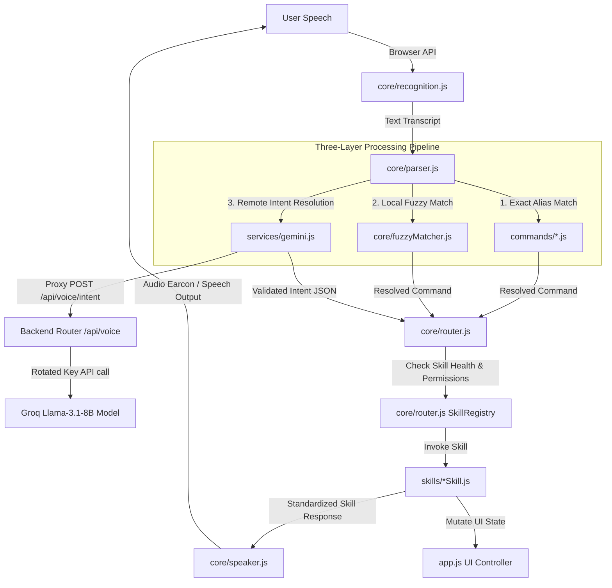
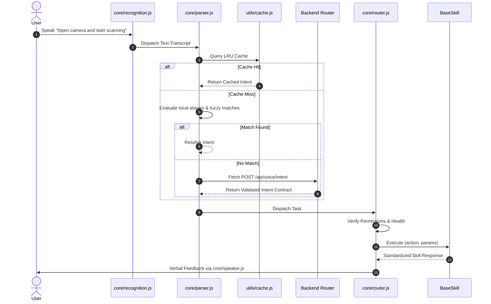

# NAZAR Voice Engine Architecture Specification (v2.0.0)

This document is the technical specification and architecture reference for the **NAZAR Voice Engine**, a voice-operating layer that coordinates speech recognition, intent resolution, sequential queuing, and verbal feedback for the NAZAR accessibility platform.

---

## 1. System Overview
The NAZAR Voice Engine sits between the web browser APIs (SpeechRecognition, SpeechSynthesis) and the core NAZAR application views. It translates verbal inputs into execution dispatches of decoupled "Skills" that run locally or query a text-only Groq Llama-3.1 API via the backend Vercel gateway using secure, rotated API keys.

---

## 2. Architecture Diagram



---

## 3. Request Flow



---

## 4. State Machines

To support both Push-to-Talk (PTT) and Continuous Listening modes, states are split into two decoupled state machines:

### Wake State
- **Sleeping**: The assistant ignores all voice input except the wake phrases (e.g. *"Start Voice Assistant"*).
- **Awake**: The assistant actively processes all recognized voice commands.

### Voice Engine State
- **Idle (⚪)**: System is active but inactive, awaiting speech input.
- **Listening (🔵)**: Web Speech Recognition API is listening to speech.
- **Thinking (🟡)**: Querying the Groq Intent API via the Express backend.
- **Executing (🟢)**: Router is calling active Skills.
- **Speaking (🟣)**: SpeechSynthesis is speaking out loud.
- **Offline (🔴)**: Browser has no network connection. Remote Groq classifications are disabled.

---

## 5. Event Bus Events

The `core/eventBus.js` module provides a central broker to coordinate asynchronous components:

| Event ID | Publisher | Subscribers | Payload | Description |
|---|---|---|---|---|
| `wake.state` | `core/state.js` | `core/recognition.js`, HUD | `{ state: 'Awake' }` | Wake status changed |
| `engine.state`| `core/state.js` | HUD, status dot | `{ state: 'Listening' }` | Engine status changed |
| `speech.heard` | `core/recognition.js` | `core/parser.js`, HUD | `{ text: '...' }` | Transcript received |
| `speech.priority`| `core/recognition.js` | `core/queue.js`, `core/speaker.js` | `{ command: 'stop' }` | Priority interrupt triggered |
| `skill.finished`| `core/router.js` | `core/queue.js`, `core/memory.js` | `{ success: true, ... }` | Skill finished executing |

---

## 6. Skill Lifecycle

Skills extend `BaseSkill` and self-register on the Router:

```
  Initialize (Router registers Skill)
            │
            ▼
    HealthCheck() ──► ['Ready', 'Busy', 'Unavailable']
            │ (if Ready)
            ▼
RequiredPermissions() ──► Check browser access
            │ (if Granted)
            ▼
    Execute(action) ──► Perform DOM / API update
            │
            ▼
   Return Standard Response ──► Spoken text feedback
            │
            ▼
      Cleanup() ──► Reset local skill states
```

---

## 7. Intent Contracts
All intent transactions between the client and backend must comply with the `IntentContract` schema:

```json
{
  "skill": "string (matches registered skill name)",
  "action": "string (matches skill action)",
  "params": {
    "type": "object",
    "properties": {
      "mode": { "type": "string" },
      "target": { "type": "string" },
      "object": { "type": "string" }
    }
  },
  "confidence": "number (0.00 to 1.00)"
}
```

---

## 8. API Endpoints
- **`POST /api/voice/intent`**
  - **Auth**: Optional session cookie.
  - **Rate Limit**: 30 requests/minute per IP (`voiceIntentLimiter`).
  - **Payload**:
    ```json
    {
      "text": "what am I looking at?",
      "sessionId": "session_99",
      "context": {
        "currentPage": "home",
        "lastScene": "Raw spatial text description..."
      }
    }
    ```
  - **Response**: Resolved intent JSON structure.

---

## 9. Folder Structure
```
voice/
  contracts/
    IntentContract.v1.json      # Schema for input intent
    SkillResponse.v1.json       # Schema for skill outputs
    Session.v1.json             # Schema for session state
  core/
    audioContextManager.js      # Web Audio analyser controller
    audioCues.js                # Programmatic audio sounds chimes
    context.js                  # Conversation session context
    conversationManager.js      # Memory window manager
    eventBus.js                 # Decoupled Pub/Sub Broker
    fuzzyMatcher.js             # Local Levenshtein edit distance logic
    memory.js                   # Conversation context history store
    parser.js                   # Exact keyword and regex triggers
    priority.js                 # Priority action mappings
    queue.js                    # Task execution scheduler
    recognition.js              # Speech Recognition wrapper
    recoveryManager.js          # Speech error recovery checks
    resourceLock.js             # Media mutex resource lock
    router.js                   # Skill registration and execution
    sessionManager.js           # Frontend session metrics tracker
    speaker.js                  # Speech Synthesis wrapper
    state.js                    # Wake/Engine State Machine
    wakeWord.js                 # Continuous wake phrase detector
  commands/
    english.js                  # English aliases
    hindi.js                    # Hindi aliases
    kannada.js                  # Kannada aliases
  skills/
    BaseSkill.js                # Base Plugin Class
    NavigationSkill.js          # Core navigation actions
    CameraSkill.js              # Viewfinder & stream actions
    OCRSkill.js                 # Text scanning logic
    SceneSkill.js               # Visual surroundings logic
    SOSSkill.js                 # SOS dispatching calls
    SettingsSkill.js            # Speed/volume/dark-mode
    ProfileSkill.js             # User accounts & login
    SpeechSkill.js              # Stop speaking, repeat last
    UISkill.js                  # Scroll down, scroll up, help
    PermissionSkill.js          # Permissions gates check
    ObjectFinderSkill.js        # Item locator
  services/
    gemini.js                   # Client-side intent proxy
    permissions.js              # Hardware permissions broker
  utils/
    errorCodes.js               # Unified codes VOICE_001 to VOICE_005
    selfTest.js                 # Startup capability diagnostics
    voiceConfig.js              # Configuration timings
    replayHarness.js            # Batch local command harness
    logger.js                   # JSDoc category prefix logger
    responseVariations.js       # Dynamic speech text variations
  controllers/
    voiceController.js          # Coordinator & UI bootstrap
```

---

## 10. Performance Targets
- **Local Parsing Latency**: `< 10 ms`
- **Queue Dispatch Latency**: `< 50 ms`
- **UI Transition Action Time**: `< 150 ms`
- **Groq Intent Resolution Target**: `< 500 ms`
- **Speech Synthesis Start Latency**: `< 300 ms`

---

## 11. Error Codes

| Code | Key | Description | Spoken Accessibility Prompt |
|---|---|---|---|
| `VOICE_001` | `MIC_DENIED` | Microphone permissions blocked | *"Microphone access is required. Please check permissions."* |
| `VOICE_002` | `REC_TIMEOUT` | Speech Recognition timed out | *"I didn't hear anything. Please try again."* |
| `VOICE_003` | `GEMINI_FAIL` | Backend intent API error / timeout | *"AI features are temporarily unavailable. Local commands remain active."* |
| `VOICE_004` | `SKILL_FAIL` | A skill execution threw an error | *"Something went wrong executing that command. Please try again."* |
| `VOICE_005` | `PERM_MISSING` | Skill requires hardware access denied | *"[Permission] access is required. Please allow access to proceed."* |

---

## 12. Testing Strategy
1. **Automated Integration Tests**: `server/tests/groqService.test.js` checks key rotation, 429 failover, and fallback responses.
2. **Replay Regression Harness**: `replayHarness.js` passes mock transcript batches in the frontend, verifying cache matches and execution outputs.
3. **Manual Voice Command Checklist**: Verified across Chrome (Windows/Android) and Safari (iOS) focusing on:
   - "Open settings" (local match)
   - "Describe surroundings" (Gemini vision fallback)
   - Interrupt priority ("Stop" while talking)
   - Session context persistence ("Translate it" after OCR scan)
